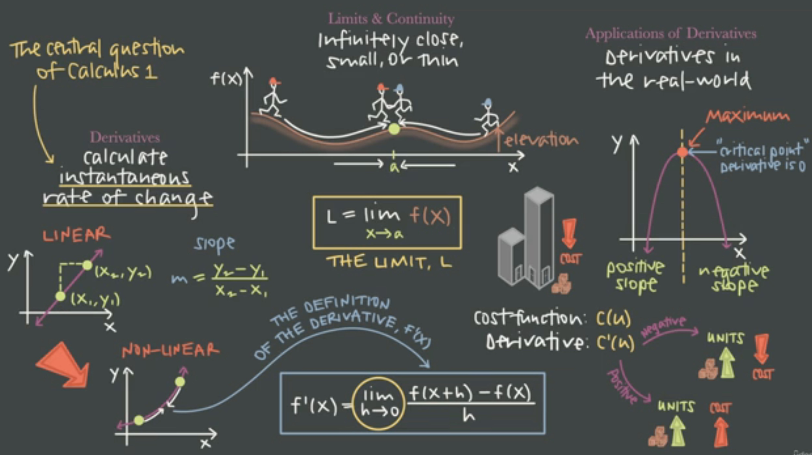

# calculus-1
This is the course about calculus 1 
https://www.udemy.com/course/calculus1/learn/lecture/37511076?components=slider_menu%2Cbuy_button%2Cdeal_badge%2Cdiscount_expiration%2Cprice_text%2Cincentives%2Cpurchase%2Credeem_coupon%2Cmoney_back_guarantee%2Cbase_purchase_section%2Cpurchase_tabs_context%2Clifetime_access_context%2Cavailable_coupons%2Cgift_this_course%2Cbuy_for_team#overview 

      

# 1. Intro
1. what about calculus 1
    - limit, rate of change or slope
    - 