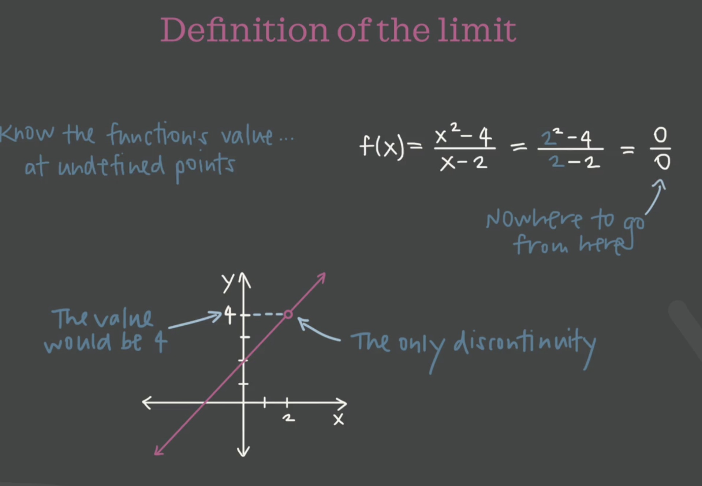
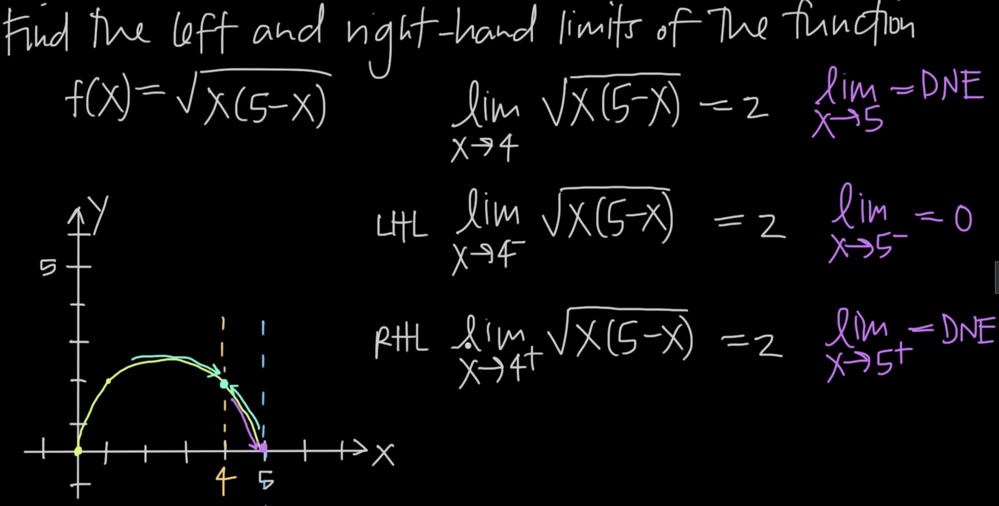
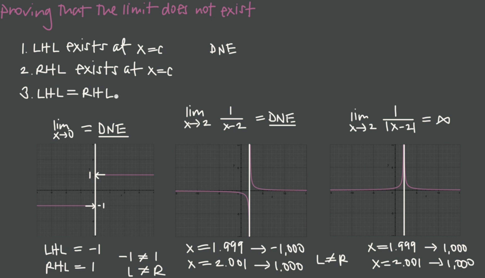
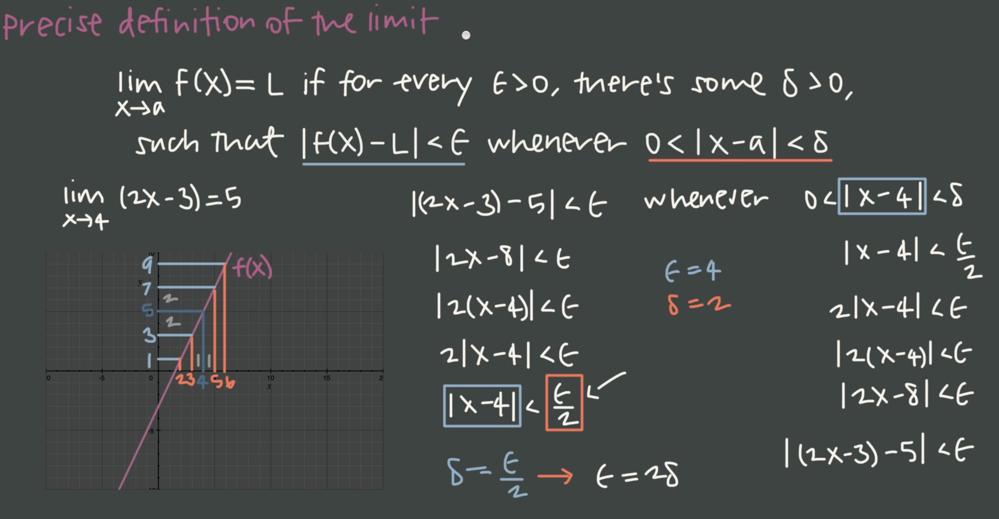

# calculus-1
This is the course about calculus 1<br>
https://www.udemy.com/course/calculus1/learn/lecture/37511076?components=slider_menu%2Cbuy_button%2Cdeal_badge%2Cdiscount_expiration%2Cprice_text%2Cincentives%2Cpurchase%2Credeem_coupon%2Cmoney_back_guarantee%2Cbase_purchase_section%2Cpurchase_tabs_context%2Clifetime_access_context%2Cavailable_coupons%2Cgift_this_course%2Cbuy_for_team#overview<br>


<br><br><br><br><br><br>

# 1. Intro
1. what about calculus 1
    - limit, rate of change or slope
    - 

2. setup env
```bash
$ pyenv local 3.10.4
$ python3.10 -m venv .venv
```

3. typeError
```log
TypeError: only length-1 arrays can be converted to Python scalars
np.sqrt()
```

4. mathematical pronounciation
http://www.uefap.com/speaking/symbols/symbols.htm<br>


<br><br><br><br><br><br>

# 2. Limits & Continuity - Definition of limit
1. definition of limits
    - the limit as x approach to a function of equal to L
    - 

2. one-sided limits
    - general limit
    - LHL - left hand limit
    - RHL - right hand limit
    - general limit can possibly exist when LHL exist, RHL exist and LHL=RHL
    - 

3. proving that the limit does not exist
    - DNE, does not exist
    - 


4. precise definition of limit
    - we want to a small interval of 𝜺 to get close to L, then get a small interval 𝜹 to get close to the x.
    - as we approach to a, the function is approaching to L
    - The precise definition of the limit proves that the limit exists and is L, as long as any number we pick between a - 𝜹 and a + 𝜹 will always return a value between L - 𝜺 and L + 𝜺
    - 

